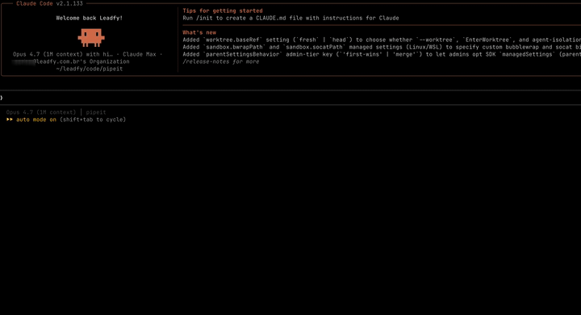

<p align="center">
  
</p>

<h1 align="center">pipeit</h1>

<p align="center">
  <strong>Pipe markdown, code, PDFs, HTML — anything out of your AI chats.<br/>
  One command, one pipeit URL.</strong>
</p>

<p align="center">
  <a href="https://www.npmjs.com/package/pipeit.live"></a>
  <a href="LICENSE"></a>
  <a href="https://github.com/repleadfy/pipeit"></a>
  <a href="https://github.com/repleadfy/pipeit/stargazers"></a>
</p>

<p align="center">
  
</p>

You're deep in a Claude Code session. The model just produced a 600-line spec, a long runbook, a design doc with code blocks and a Mermaid diagram. You want to read it on your phone over coffee, or hand it to a teammate without making them open Claude.

`/pipeit` does that in one keystroke. The CLI reads your file straight from disk — no LLM tokens — uploads it to `pipeit.live`, and hands you a URL with a rendered doc, table of contents, dark mode, and reading-progress sync.

## Install

```
/plugin marketplace add repleadfy/pipeit
/plugin install pipeit@repleadfy
```

Or, from a terminal:

```
npx pipeit.live
```

Either path lands the same Claude Code plugin and MCP server connection.

## Quick start

```
/pipeit ./README.md
→ https://pipeit.live/d/x9k2

/pipeit                       # share the last markdown block from this chat
/pipeit --new ./snapshot.md   # force a new URL (don't update-in-place)
/pipeit --public ./notes.md   # publicly shareable (no login required to read)
```

First run opens your browser once for sign-in. After that, Claude Code holds the access token.

---

## Features

- **Direct disk → URL.** The CLI reads your file from disk and POSTs it. Nothing passes through your LLM context, so you don't pay for tokens twice and uploads stay sub-second for text docs.
- **Multi-format.** Markdown, HTML, plain text, and PDF — format is auto-detected server-side, the client never declares it. Markdown renders rich; HTML renders sandboxed; PDF renders via pdf.js (portable to mobile/headless).
- **Update-in-place.** Re-running `/pipeit ./file.md` updates the same URL with a new version — no clutter, no re-sharing.
- **Renders the way an AI writes.** Headings, TOC, syntax highlight, KaTeX, Mermaid, dark/light, search (`⌘K`), keyboard nav.
- **Full-text search.** Search across all your docs by title *and* body, ranked — find that runbook from three weeks ago.
- **Drag-and-drop upload.** A browser `/upload` page takes md/txt/html/pdf (multi-file, mobile-friendly) when you're not in Claude Code.
- **Themeable.** Three runtime-selectable skins — Reading Room (warm editorial), Slate (refined neutral), Terminal (dev brutalist) — each with light/dark.
- **Reading-progress sync.** Pick up where you left off, on any device.
- **Public/private toggle.** Flip after upload; the URL stays the same.
- **OAuth (Google / GitHub / email)** with PKCE. No API keys, no credentials on disk outside Claude Code.
- **Open source. MIT.** Hosted at `pipeit.live` for free, or [self-host](docs/install.md).

## Why pipeit

|  | pipeit | Gist | Pastebin | Copy from chat |
|---|:-:|:-:|:-:|:-:|
| Doesn't pass content through your LLM context | ✓ | ✗ | ✗ | ✗ |
| Updates the same URL on re-upload | ✓ | force-push | ✗ | ✗ |
| Renders TOC / Mermaid / KaTeX | ✓ | partial | ✗ | n/a |
| Reading-progress sync across devices | ✓ | ✗ | ✗ | n/a |
| One command from Claude Code | ✓ | ✗ | ✗ | n/a |

Gist is great for code snippets. pipeit is built for the long-form output an AI conversation produces — specs, runbooks, designs, tutorials — that you want to read like a doc, not like a paste.

## How it works

```
Claude Code  →  pipeit-upload (mjs)  →  POST /api/docs  →  Postgres
                  reads file from disk        ↓
                                          pipeit.live/d/{slug}
                                          Hono · React 19 · Drizzle ORM
```

Your file content never enters the LLM context. The `/pipeit` skill shells out to a small Node binary that reads from disk and posts directly. A 1 MB doc uploads in roughly the same time as a 1 KB one.

## Roadmap

`pipeit.live` renders Markdown, HTML, plain text, and PDF today. We're still expanding the viewer:

- [x] **PDF** — upload and view, no copy-paste through tokens.
- [x] **HTML** — sandboxed render, sane defaults.
- [x] **Search across your docs** — find that runbook from three weeks ago.
- [ ] **DOCX / XLSX** — common office formats, rendered in-browser.
- [ ] **Images** — direct paste / upload, full-resolution viewing.

If a format you need isn't here, [open an issue](https://github.com/repleadfy/pipeit/issues) — the roadmap is driven by what people actually share.

## Limits

| Limit | Value |
|---|---|
| Doc size (text: md / html / txt) | 1 MB |
| Doc size (PDF) | 25 MB |
| Uploads per hour | 60 / user |
| API calls per minute | 300 / user |
| Auth attempts | 10 / minute / IP |

If you're hitting these, [open an issue](https://github.com/repleadfy/pipeit/issues) — they're guardrails, not goals.

## Self-host

pipeit ships as a TypeScript monorepo, deployable to Kubernetes (manifests under [`kdep/`](kdep/)) or any Node + Postgres host:

- `packages/web` — React 19 · Vite · Tailwind 4
- `packages/server` — Hono · Drizzle ORM · Postgres
- `packages/mcp` — MCP server (OAuth proxy)
- `packages/cli` — `pipeit-upload` and `pipeit.live` installers
- `plugins/pipeit` — the Claude Code plugin

Walkthrough: [`docs/install.md`](docs/install.md).

## Documentation

- [Install](docs/install.md) — plugin / npm / self-host
- [Contributing](CONTRIBUTING.md) — local dev, commit style, PR flow
- [Security](SECURITY.md) — vulnerability disclosure
- [Changelog](CHANGELOG.md)

## License

[MIT](LICENSE).
